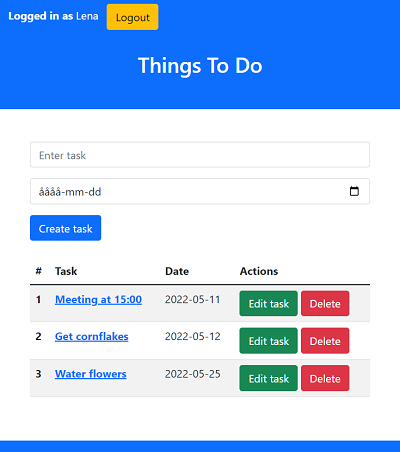

<h1 align="center">PHP & MYSQL CRUD Todo App</h1>

<strong>Simple Task Manager built with PHP(OOP)</strong>
 Inlämning 2, Systemutveckling 50 yhp

 
<h2>About</h2>

This app was built as a part of the backend development course at Medieinstitutet (WIE21S). 

<h2>Key points</h2>

- Object-oriented Programming in PHP
- User Authentication
- MySQL database for application storage

<h2>Credits</h2>

- Liudmila Kazakbaeva

<h2>Copyright</h2>
This project is licensed under the terms of the MIT license and protected by Udacity Honor Code and Community Code of Conduct. See <a href="LICENSE.md">license</a> and <a href="LICENSE.DISCLAIMER.md">disclaimer</a>.